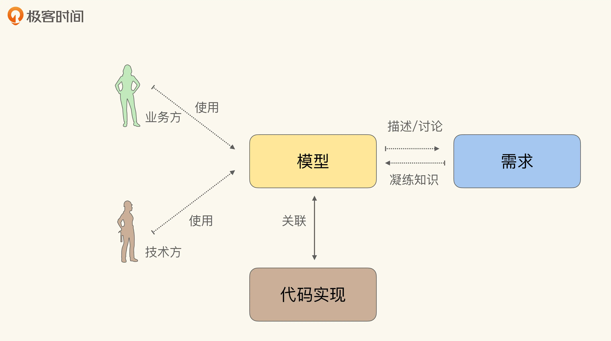

# 领域驱动设计-初探

## 什么是DDD (领域驱动设计)？
&ensp;&ensp;先来复制粘贴一段[维基百科定义](https://en.wikipedia.org/wiki/Domain-driven_design)
> Domain-driven design (DDD) is a software design approach focusing on modelling software to match a domain according to input from that domain's experts. 

&ensp;&ensp;再简单粗暴的翻译一下
> 领域驱动设计 (DDD) 是一套指导软件设计的思想及方法论，它以**领域专家**输入的领域知识为基础，关注如何为软件构建一个匹配业务领域的模型。

&ensp;&ensp;在2003年，Eric Evans 在他的名著“[Domain Driven Design：Tackling the Complexity in the Heart of Software](https://book.douban.com/subject/1418618/)”中提出了领域驱动设计这一概念，随后这一理念迅速被行业采纳，时至今日仍是绝大多数人进行业务建模的首要方法。

Eric 倡导的**领域驱动设计是一种模型驱动的设计方法**：通过领域模型（Domain Model）捕捉领域知识，使用领域模型构造更易维护的软件。

## 什么是模型
从[百度百科-模型](https://baike.baidu.com/item/%E6%A8%A1%E5%9E%8B/1741186?fr=aladdin)复制粘贴以下定义：
> 通过主观意识借助实体或者虚拟表现，构成客观阐述形态结构的一种表达目的的物件。  

> 从广义上讲：如果一件事物能随着另一件事物的改变而改变，那么此事物就是另一件事物的模型。

&ensp;&ensp;比如，现实中的玩具飞机模型，在某种程度上阐述了真实飞机的外表形态。DDD里所说的模型，就是通过文字、图像等方式来阐述现实中的业务规则。

&ensp;&ensp;从某种程度上来说，我们最后构建出来的软件（代码）本身也是一种模型，代码也在某种程度上阐述了真实的业务规则，但是为什么我们还需要额外的一层模型呢？

&ensp;&ensp;因为我们需要的模型不仅仅是给研发或者产品使用的，在领域驱动设计中的模型是为了定义问题、统一概念而存在的，它的存在是为了让产品、业务、研发等参与方在一个标准下进行有效沟通。然而代码不可能指望产品和业务能够看懂，在代码可读性比较差的情况下，甚至连研发都搞不清楚代码所要表达的业务规则。

### 模型驱动开发 MDD（model driven development）
&ensp;&ensp;我们看一个普通的功能研发流程。首先，产品经理会和领域专家进行沟通，这个阶段可能会有研发人员参与，产品经理根据讨论结果生成需求说明文档，理想情况下，文档会包含一些概念的定义、用户地图、用户故事等。然后，研发会根据需求说明进行相关的设计和技术文档编写，理想情况下，这里会有设计接口、表结构设计、必要的UML图等。最后研发人员会进行代码编写。而刚才所说的“概念的定义”、“用户地图”、“用户故事”、“UML图”，这些文档都是模型的表现形式，也就是说大多数情况下，不考虑模型的质量问题，我们的研发流程中都有进行建模工作。

&ensp;&ensp;那么有了模型就可以称为模型驱动设计了吗？ 并不是，模型驱动设计的核心是，模型和代码之间应该是紧密联系的，修改模型的变化就会引起代码的变更。但现实是，往往我们的代码和模型文档是分离的。
&ensp;&ensp;一种原因是文档更新迟滞，可能代码变更了，但是文档没有更新；另一种原因是在编写代码的时候，代码就抛弃了一些业务知识，如果我们没有正确地使用面向对象的编程方式，这种情况就会发生。当模型和代码逻辑不同步时，耗费精力维护的模型文档也不能让人放心地使用。

&ensp;&ensp;正确的模型驱动设计应该如下图所示：

### 领域驱动设计下的建模

  
&ensp;&ensp; 模型在领域驱动设计中，其实主要有三个用途：

* 通过模型反映软件实现（Implementation）的结构；
* 以模型为基础形成团队的统一语言（Ubiquitous Language）；
* 把模型作为精粹的知识，以用于传递。
  
&ensp;&ensp; 在 DDD 中，Eric Evans 提倡了一种叫做知识消化（Knowledge Crunching）的方法帮助我们去提炼领域模型。这么多年过去了，也产生了很多新的提炼领域模型的方法，但它们在宏观上仍然遵从知识消化的步骤。知识消化的五个步骤知识消化法具体来说有五个步骤，分别是：
* 关联模型与软件实现；
* 基于模型提取统一语言；
* 开发富含知识的模型；
* 精炼模型；
* 头脑风暴与试验。

### 通用语言-Ubiquitous（/juːˈbɪkwɪtəs/） Language
&ensp;&ensp;所有的参与方使用一套模型进行讨论之后，大家使用的名词、动词概念也会趋于统一，进而形成“通用语言”。比如，对于“基础房型”，有时候也称为“物理房型"。“售卖”又被称为“产品”。如果一个团队（在一个限界上下文）里面对于同一个概念的用词不统一，那么沟通时会存在翻译成本，可能还会造成误解。  
&ensp;&ensp;随着业务的发展，模型也会在讨论中逐渐演进，会诞生一些新的概念被团队理解消化，这些新概念的定义和命名应该也是统一的，变成通用语言的一部分。随着新概念被确认是可行的，模型和代码应该也随之改变，新的概念被使用，而过时的概念应该被废弃。

## 如何践行DDD？
### 战略 VS 战术
    TODO
### 战略
    TODO
#### 问题域与解决方案空间
    TODO
#### 领域划分
    TODO 正交分解 引用《许式伟的架构课》
    TODO

### 战术
    TODO

## 通用语言与限界上下文
    TODO 概念解释
### 通用语言有什么好处
    统一各种概念，降低沟通成本
    代码内部，代码和产品概念用词一致
### 识别不同限界上下文
### 示意图
    TODO 通用语言模型图

## 建模方法
### 面向数据持久化的建模方式
    TODO 缺陷
## 建模方式
### 事件风暴
### 四色建模

## 模型有了，怎么写代码？
### 面向对象设计
    理想的pojo和扁平的三层架构把我们带进了面向过程编程岔路。
    为什么说这是一条岔路?
    面向过程/数据库编程难以封装业务实体及逻辑。 你会发现代码很快就会开始出现各种坏味道，违背开闭原则、迪米特原则、DRY原则等等。
    但是面向对象编程可以避免这些情况出现吗？ 在良好的设计和必要持续性重构下是可以避免的。
#### 贫血模型，充血模型，涨血模型
    TODO 
### 楔子-幻想
    如果有一个无限内存永不宕机的电脑，你会怎么设计你的程序？ (Small Talk)
    也就是说我们可以不用把数据特意的持久化，如果摆脱数据库的schema，我们会怎么设计软件？
#### 回到现实
    不可避免的持久化过程，且io本身是耗时很久的操作。在保证系统吞吐的情况，我们要尽量保证每次只操作必要的那些实体。
    否则可能出现对象直接直接引用过多引发连锁获取的问题
##### 实体-聚合-聚合根
##### 领域服务-领域事件

##### 存储过程进行抽象-Repository
    存储的技术不同，导致持久化过程和读取的，我们需要对存储过程进行抽象。

### 无副作用
#### 值对象
#### 无副作用的函数

### 防腐层
    TODO

## 架构
### 事件驱动
    领域事件
### 六边形架构-圆葱架构
### CQRS-邪教？

## 代码example

## 参考资料
* [Domain Driven Design：Tackling the Complexity in the Heart of Software](https://book.douban.com/subject/1418618/)
* [Implementing Domain-Driven Design](https://book.douban.com/subject/11940943/)
* [极客时间-如何落地业务建模](https://time.geekbang.org/column/intro/100082101?tab=catalog)
* [Java Modeling In Color With UML](https://book.douban.com/subject/1440291/)
* [DDD之事件风暴Event Storming](https://zhuanlan.zhihu.com/p/399103071)