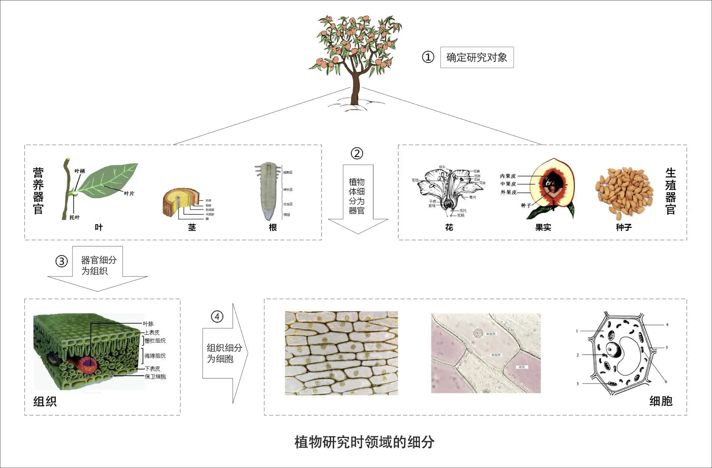
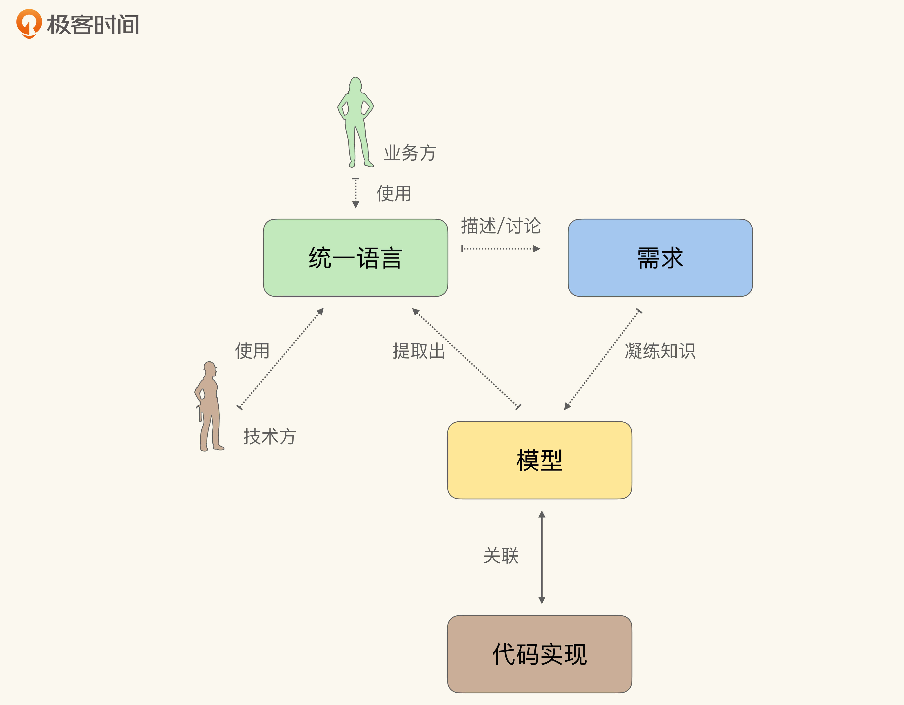

# 领域驱动设计-初探
*本文大量篇幅引用 [极客时间-DDD实战课](https://time.geekbang.org/column/article/149943)，有兴趣可以阅读原文。*

&ensp;&ensp;进入微服务架构时代以后，微服务确解决了原来采用集中式架构的单体应用的很多问题，比如扩展性、弹性伸缩能力、小规模团队的敏捷开发等等。但在看到这些好处的同时，微服务实践过程中也产生了不少的争论和疑惑：微服务的粒度应该多大呀？微服务到底应该如何拆分和设计呢？微服务的边界应该在哪里？

&ensp;&ensp;可以说，很久以来都没有一套系统的理论和方法可以指导微服务的拆分，包括微服务架构模式的提出者 Martin Fowler 在提出微服务架构的时候，也没有告诉我们究竟应该如何拆分微服务。 于是，在这段较长的时间里，就有不少人对微服务的理解产生了一些曲解。有人认为：“微服务很简单，不过就是把原来一个单体包拆分为多个部署包，或者将原来的单体应用架构替换为一套支持微服务架构的技术框架，就算是微服务了。” 还有人说：“微服务嘛，就是要微要小，拆得越小效果越好。” 然后过度拆分可能导致的后果就是运维成本过高，最终系统无法上线。

&ensp;&ensp;微服务拆分困境产生的根本原因就是不知道业务或者微服务的边界到底在什么地方。换句话说，确定了业务边界和应用边界，这个困境也就迎刃而解了。而领域驱动正好能帮助我们解决这个问题，这也是**DDD**随着**微服务**兴起被重新热议的原因。

## 什么是DDD (领域驱动设计)？

&ensp;&ensp;在2004年，Eric Evans 在他发表的名著“[Domain Driven Design：Tackling the Complexity in the Heart of Software](https://book.douban.com/subject/1418618/)”中提出了领域驱动设计这一概念。Eric 倡导的**领域驱动设计是一种模型驱动的设计方法**：通过领域模型（Domain Model）捕捉领域知识，使用领域模型构造更易维护的软件。尤其在进行大型的复杂软件系统设计时，DDD可以提供设计上的理论指导，可以让我们设计出更合理的系统。通过学习领域驱动设计，也能让我们发现现有系统的不足，找到合理的演进方向。

### DDD 包括战略设计和战术设计两部分。
&ensp;&ensp;战略设计主要从业务视角出发，建立业务领域模型，划分领域边界，建立**通用语言**的**限界上下文**，限界上下文可以作为微服务设计的参考边界。

&ensp;&ensp;战术设计则从技术视角出发，侧重于领域模型的技术实现，完成软件开发和落地，包括：**聚合根**、**实体**、**值对象**、**领域服务**、**应用服务**和**资源库**等代码逻辑的设计和实现。  

&ensp;&ensp;这些概念间的关系是这样的

## 领域、子域
### 领域与子域
&ensp;&ensp;引用《实现领域驱动设计》中的说明：
> 从广义上讲，领域（Domain）即是一个组织所做的事情以及其中所包含的一切。

&ensp;&ensp;我们再看一下汉语词典中对领域的解释：“领域是从事一种专门活动或事业的范围、部类或部门。”百度百科对领域的解释：“领域具体指一种特定的范围或区域。”  
&ensp;&ensp;两个解释有一个共同点——范围。对了！领域就是用来确定范围的，范围即边界，这也是 DDD 在设计中不断强调边界的原因。 

&ensp;&ensp;在研究和解决业务问题时，DDD 会按照一定的规则将业务领域进行细分，当领域细分到一定的程度后，DDD 会将问题范围限定在特定的边界内，在这个边界内建立领域模型，进而用代码实现该领域模型，解决相应的业务问题。简言之，DDD 的领域就是这个边界内要解决的业务问题域。

&ensp;&ensp;领域既然是一种范围，那么就是可大可小的，大型的企业可能覆盖的领域会很大。 领域也可以进一步划分，拆分成子域，子域也可以进一步拆分。有点类似于“系统”与“子系统”的“套娃”概念。

&ensp;&ensp;DDD 的研究方法与自然科学的研究方法类似。当人们在自然科学研究中遇到复杂问题时，通常的做法就是将问题一步一步地细分，再针对细分出来的问题域，逐个深入研究，探索和建立所有子域的知识体系。当所有问题子域完成研究时，我们就建立了全部领域的完整知识体系了。

&ensp;&ensp;我们来看一下上面这张图。这个例子是在讲如何给桃树建立一个完整的生物学知识体系。初中生物课其实早就告诉我们研究方法了。它的研究过程是这样的。
* 第一步：确定研究对象，即研究领域，这里是一棵桃树。
* 第二步：对研究对象进行细分，将桃树细分为器官，器官又分为营养器官和生殖器官两种。其中营养器官包括根、茎和叶，生殖器官包括花、果实和种子。桃树的知识体系是我们已经确定要研究的问题域，对应 DDD 的领域。根、茎、叶、花、果实和种子等器官则是细分后的问题子域。这个过程就是 DDD 将领域细分为多个子域的过程。
* 第三步：对器官进行细分，将器官细分为组织。比如，叶子器官可细分为保护组织、营养组织和输导组织等。这个过程就是 DDD 将子域进一步细分为多个子域的过程。
* 第四步：对组织进行细分，将组织细分为细胞，细胞成为我们研究的最小单元。细胞之间的细胞壁确定了单元的边界，也确定了研究的最小边界。

&ensp;&ensp;我们知道细胞核、线粒体、细胞膜等物质共同构成细胞，这些物质一起协作让细胞具有这类细胞特定的生物功能。在这里你可以把细胞理解为 DDD 的聚合，细胞内的这些物质就可以理解为聚合里面的聚合根、实体以及值对象等，在聚合内这些实体一起协作完成特定的业务功能。这个过程类似 DDD 设计时，确定微服务内功能要素和边界的过程。

&ensp;&ensp;这里总结一下，就是说每一个细分的领域都会有一个知识体系，也就是 DDD 的领域模型。在所有子域的研究完成后，我们就建立了全域的知识体系了，也就建立了全域的领域模型。

&ensp;&ensp;回归现实业务，在OTA领域中，我们知道有“酒店预订”、“机票预订”、“火车票预订”等等概念，这些都可以视为OTA的子域，子域也是一个领域； 而在“酒店预订”这个领域中，我们又可以划分“查询”子域，“订单”子域、“酒店信息”子域、“供应商”子域、“结算”子域等等。在“酒店信息”子域中又可以分为“投票”、“审核流”子域、“通用日志”子域等。

### 核心域、通用域和支撑域
&ensp;&ensp;在领域不断划分的过程中，领域会细分为不同的子域，子域可以根据自身重要性和功能属性划分为三类子域，它们分别是：**核心域**、**支撑域**、**通用域**。

&ensp;&ensp;**核心域**是包含企业核心业务和竞争力的子域。

&ensp;&ensp;**通用域**：没有太多个性化的诉求，同时被多个子域使用的通用功能子域。比如用户鉴权子域。

&ensp;&ensp;**支撑域**：必需但既不包含决定产品和公司核心竞争力的功能，也不包含通用功能的子域。

#### 为什么要划分核心域、通用域和支撑域，主要目的是什么呢？
&ensp;&ensp;还是拿上图的桃树来说吧。我们将桃树细分为了根、茎、叶、花、果实和种子等六个子域，那桃树是否有核心域？有的话，到底哪个是核心域呢？

&ensp;&ensp;不同的人对桃树的理解是不同的。如果这棵桃树生长在公园里，在园丁的眼里，他喜欢的是“人面桃花相映红”的阳春三月，这时花就是桃树的核心域。但如果这棵桃树生长在果园里，对果农来说，他则是希望在丰收的季节收获硕果累累的桃子，这时果实就是桃树的核心域。  

&ensp;&ensp;在不同的场景下，不同的人对桃树核心域的理解是不同的，因此对桃树的处理方式也会不一样。园丁更关注桃树花期的营养，而果农则更关注桃树落果期的营养，有时为了保证果实的营养供给，还会裁剪掉疯长的茎和叶（通用域或支撑域）。  

&ensp;&ensp;同样的道理，公司在 IT 系统建设过程中，由于预算和资源有限，对不同类型的子域应有不同的关注度和资源投入策略，记住好钢要用在刀刃上。很多公司的业务，表面看上去相似，但商业模式和战略方向是存在很大差异的，因此公司的关注点会不一样，在划分核心域、通用域和支撑域时，其结果也会出现非常大的差异。  

&ensp;&ensp;假如我们要构建一个新的“线上酒店预订”系统，企业的愿景是打造最专业的主题酒店，那么软件的核心域可能就会是“酒店信息”子域，以便更好的展示不同主题的酒店信息，比如二次元主题酒店、电竞主题酒店等。

&ensp;&ensp;如果企业的愿景是提供全网最高性价比的酒店预订服务，那么核心域可能就是“查询”域和“供应商”域。

## 通用语言和限界上下文

### 通用语言-Ubiquitous Language （发音：/juːˈbɪkwɪtəs/）
&ensp;&ensp;我们看一个普通的功能研发流程：
* 首先，产品经理会和领域专家进行沟通，这个阶段可能会有研发人员参与，产品经理根据讨论结果生成需求说明文档，理想情况下，文档会包含一些概念的定义、用户地图、用户故事等。
* 然后，研发会根据需求说明进行相关的设计和技术文档编写，理想情况下，这里会有设计接口、表结构设计、必要的UML图等。
* 最后研发人员会进行代码编写。

&ensp;&ensp;如果我们在沟通中没有对概念的统一标准，那么沟通上就会出现偏差，导致最后的功能和实际预想的有偏差。比如：
> 小明：妈，这次期末考试我考了100分，说好的奖励我一个苹果哦～
> 明妈：喏，路口刚买的，10块钱3斤，包甜！
> 小明：......

&ensp;&ensp;如果小明和明妈提前明确“苹果”的定义就不会吃亏了。在研发过程中，我们同样需要为各种业务概念做明确的定义，把这些明确的定义落地成文档并加以使用，那么在沟通、书写用户故事和其他文档的时候就会避免出现歧义的情况。那么这样一套概念的定义我们就可以称之为“通用语言”。明确的概念定义我想很多团队都在使用了，但是还是要注意：

* 但是我们要注意在非技术沟通中，需要规避使用其他非技术人员听不懂的词语，整个团队（需求相关方）都使用这个“通用语言”进行沟通。如果我们的沟通需求的时候是拿着ER在聊加某某表、拿着接口文档考虑怎么新增字段，我们要注意了，这种沟通往往会导致一些领域概念的丢失。
* 在定义概念的时候，把英文翻译也标准化，因为我们在编写代码的时候也要使用这些概念来编码。这样我们的代码才能够富含领域知识，才能让人读得懂。
* “通用语言”不一定是天然就存在的词汇，可能是在模型讨论中发现一些隐藏的领域概念，需要团队集思广益来定义出一个合理的词汇，用来表达这个领域概念。

### 限界上下文
&ensp;&ensp; 限界上下文，望文生义，就是一个有限定边界的领域（语义）上下文。我们知道语言都有它的语义环境，同样，通用语言也有它的上下文环境。为了避免同样的概念或语义在不同的上下文环境中产生歧义，DDD 在战略设计上提出了“限界上下文”这个概念，用来确定通用语言的语义边界。

> 在一个明媚的早晨，孩子起床问妈妈：“今天应该穿几件衣服呀？”妈妈回答：“能穿多少就穿多少！”那到底是穿多还是穿少呢？  

&ensp;&ensp;那到底是穿多还是穿少呢？ 如果没有具体的语义环境，还真不太好理解。但是，如果你已经知道了这句话的语义环境，比如是寒冬腊月或者是炎炎夏日，那理解这句话的涵义就会很容易了。

&ensp;&ensp;而在软件项目中，我们往往容易落入这个陷阱，就是试图在全局定义一个大而全的软件模型， 在这个模型中，每个概念都是唯一，只有一种定义的。比如我们在“酒店预订”中，我们会全局定义一个“酒店”的概念，但是这个“酒店”在不同上下文中含义是有区别的。
> 在“酒店信息”上下文中: 物理意义上存在的一家酒店，包含酒店名称、地理位置等信息。
> 在“供应商”上下文中： 供应商提供的酒店资源，包含酒店名称、地理位置、供应商来源、结算方式等信息。

### 识别限界上下文
&ensp;&ensp;说到这里，我们大概了解了限界上下文的概念.

&ensp;&ensp;理想情况下，一个子域会对应一个限界上下文。因为现实中，我们往往不是从0开始构建软件系统，我们会在遗留系统或者外部系统之上构建新的软件，所以可能会使用两个或多个子域对应一个限界上下文，或者一个子域中包含几个限界上下文的方式来定义两者之间的关系。（详细见-实现领域驱动设计 2.3 理解领域上下文）

&ensp;&ensp;但是限界上下文的边界具体怎么划定呢？

推荐两篇文章：
* [识别限界上下文](https://baijiahao.baidu.com/s?id=1656236780540023777&wfr=spider&for=pc)

#### 微服务拆分
&ensp;&ensp;理论上，一个限界上下文就可以作为一个独立的微服务。这是站在业务角度的拆分依据，但是实际上在划分微服务的时候还要考虑团队、拓展性、性能等等。 可以参考以下文章：
* [极客时间-从0开始学架构-《微服务架构最佳实践-方法篇》](https://time.geekbang.org/column/article/11207)
* [极客时间-DDD 实战课-《微服务设计和拆分要坚持哪些原则？》](https://time.geekbang.org/column/article/171185)

## 模型驱动开发
&ensp;&ensp;领域驱动设计模型驱动开发(MDD)。
### 什么是模型？
从[百度百科-模型](https://baike.baidu.com/item/%E6%A8%A1%E5%9E%8B/1741186?fr=aladdin)复制粘贴以下定义：
> 通过主观意识借助实体或者虚拟表现，构成客观阐述形态结构的一种表达目的的物件。  

> 从广义上讲：如果一件事物能随着另一件事物的改变而改变，那么此事物就是另一件事物的模型。

&ensp;&ensp;比如，现实中的玩具飞机模型，在某种程度上阐述了真实飞机的外表形态。DDD里所说的模型，就是通过文字、图像等方式来阐述现实中的业务规则。

&ensp;&ensp;从某种程度上来说，我们最后构建出来的软件（代码）本身也是一种模型，代码也在某种程度上阐述了真实的业务规则，但是为什么我们还需要额外的一层模型呢？

&ensp;&ensp;因为我们需要的模型不仅仅是给研发或者产品使用的，在领域驱动设计中的模型是为了定义问题、统一概念而存在的，它的存在是为了让产品、业务、研发等参与方在一个标准下进行有效沟通。然而代码不可能指望产品和业务能够看懂，**在代码可读性比较差的情况下，甚至连研发都搞不清楚代码所要表达的业务规则**。所以我们这里所说的模型是能够表达领域知识（或者是业务规则）的说明性的文字和图形，比如UML图或者其他具备准确表述能力的图形。注意，这里的模型不是指技术上的系统架构图，而是表达业务知识的模型。

&ensp;&ensp;然而用户故事在某些方面是比较模糊的，没法准确的表达领域实体之间的关系。而专业的UML图可能用太偏向于技术，不利于非技术人员参与建模的过程。所以我们需要一种可以激发所有人参与的，能够表达实际领域知识的建模方法。

### 建模方法
#### 事件风暴
&ensp;&ensp; DDD社区最流行的一种建模方式，适合进行业务探索。详细见 [DDD之事件风暴Event Storming](https://zhuanlan.zhihu.com/p/399103071)

#### 四色建模
&ensp;&ensp; 可以借鉴下这本书 [Java Modeling In Color With UML](https://book.douban.com/subject/1440291/)

### 模型驱动开发 MDD（model driven development）
&ensp;&ensp;那么有了模型就可以称为模型驱动设计了吗？ 并不是，模型驱动设计的核心是，模型和代码之间应该是紧密联系的，修改模型的变化就会引起代码的变更。但现实是，往往我们的代码和模型文档是分离的。而当模型和代码逻辑不同步时，耗费精力维护的模型文档也不能让人放心地使用。

&ensp;&ensp;一种原因是文档更新迟滞，可能代码变更了，但是文档没有更新；另一种原因是在编写代码的时候，代码就已经抛弃了一些业务语义，而当编写这段代码的人员离开后，那么相对应的领域知识也就遗失了。如果我们正确地使用面向对象的编程方式，把业务语义编码在软件中就可以避免这种情况发生。

&ensp;&ensp;正确的模型驱动设计应该如下图所示：

### DDD-知识消化循环
&ensp;&ensp; 在 DDD 中，Eric Evans 提倡了一种叫做知识消化（Knowledge Crunching）的方法帮助我们去提炼领域模型。知识消化的五个步骤知识消化法具体来说有五个步骤，分别是：
* 关联模型与软件实现；
* 基于模型提取统一语言；
* 开发富含知识的模型；
* 精炼模型；
* 头脑风暴与试验。
 
&ensp;&ensp;随着业务的发展，模型也会在讨论中逐渐演进，会诞生一些新的概念被团队理解消化，这些新概念的定义和命名应该也是统一的，变成通用语言的一部分。随着新概念被确认是可行的，模型和代码应该也随之改变，新的概念被使用，而过时的概念应该被废弃。

## 参考资料
推荐：
* [Domain Driven Design：Tackling the Complexity in the Heart of Software](https://book.douban.com/subject/1418618/)
* [DDD之事件风暴Event Storming](https://zhuanlan.zhihu.com/p/399103071)
* [极客时间-DDD实战课](https://time.geekbang.org/column/intro/100037301?tab=catalog)
* [Implementing Domain-Driven Design](https://book.douban.com/subject/11940943/)
* [极客时间-从0开始学架构-《微服务架构最佳实践-方法篇》](https://time.geekbang.org/column/article/11207)
* [极客时间-如何落地业务建模](https://time.geekbang.org/column/intro/100082101?tab=catalog)
* [Java Modeling In Color With UML](https://book.douban.com/subject/1440291/)
* [识别限界上下文](https://baijiahao.baidu.com/s?id=1656236780540023777&wfr=spider&for=pc)
* [github 示例代码](https://github.com/citerus/dddsample-core)
* [github ddd资源汇总 awsome-ddd](https://github.com/heynickc/awesome-ddd)
* [走出微服务误区：避免从单体到分布式单体](https://juejin.cn/post/6844904202565599240)

  