# 领域驱动设计-初探
*本文大量篇幅引用 [极客时间-DDD实战课](https://time.geekbang.org/column/article/149943)，有兴趣可以阅读原文。*

&ensp;&ensp;进入微服务架构时代以后，微服务确解决了原来采用集中式架构的单体应用的很多问题，比如扩展性、弹性伸缩能力、小规模团队的敏捷开发等等。但在看到这些好处的同时，微服务实践过程中也产生了不少的争论和疑惑：微服务的粒度应该多大呀？微服务到底应该如何拆分和设计呢？微服务的边界应该在哪里？

&ensp;&ensp;可以说，很久以来都没有一套系统的理论和方法可以指导微服务的拆分，包括微服务架构模式的提出者 Martin Fowler 在提出微服务架构的时候，也没有告诉我们究竟应该如何拆分微服务。 于是，在这段较长的时间里，就有不少人对微服务的理解产生了一些曲解。有人认为：“微服务很简单，不过就是把原来一个单体包拆分为多个部署包，或者将原来的单体应用架构替换为一套支持微服务架构的技术框架，就算是微服务了。” 还有人说：“微服务嘛，就是要微要小，拆得越小效果越好。” 然后过度拆分可能导致的后果就是运维成本过高，系统无法上线。

&ensp;&ensp;微服务拆分困境产生的根本原因就是不知道业务或者微服务的边界到底在什么地方。换句话说，确定了业务边界和应用边界，这个困境也就迎刃而解了。而领域驱动正好能帮助我们解决这个问题，这也是**DDD**随着**微服务**兴起被重新热议的原因。

## 什么是DDD (领域驱动设计)？

&ensp;&ensp;在2004年，Eric Evans 在他发表的名著“[Domain Driven Design：Tackling the Complexity in the Heart of Software](https://book.douban.com/subject/1418618/)”中提出了领域驱动设计这一概念。Eric 倡导的**领域驱动设计是一种模型驱动的设计方法**：通过领域模型（Domain Model）捕捉领域知识，使用领域模型构造更易维护的软件。尤其在进行大型的复杂软件系统设计时，DDD可以提供设计上的理论指导，可以让我们设计出更合理的系统。通过学习领域驱动设计，也能让我们发现现有系统的不足，找到合理的演进方向。

### DDD 包括战略设计和战术设计两部分。
&ensp;&ensp;战略设计主要从业务视角出发，建立业务领域模型，划分领域边界，建立**通用语言**的**限界上下文**，限界上下文可以作为微服务设计的参考边界。

&ensp;&ensp;战术设计则从技术视角出发，侧重于领域模型的技术实现，完成软件开发和落地，包括：**聚合根**、**实体**、**值对象**、**领域服务**、**应用服务**和**资源库**等代码逻辑的设计和实现。
这些概念间的关系是这样的

## 领域、子域
### 领域与子域

&ensp;&ensp;从广义上讲，领域（Domain）即是一个组织所做的事情以及其中所包含的一切。但是“领域”这个词承载了太多含义，领域可大可小，大型的企业可能覆盖的领域会很大。 比如在OTA领域中，我们知道有“酒店预订”、“机票预订”、“火车票预订”等等概念，这些都可以视为OTA的子域，子域也是一个领域； 而在“酒店预订”这个领域中，我们又可以划分“查询”子域，“订单”子域、“酒店信息”子域、“供应商”子域、“结算”子域等等，这个有点类似于“系统”与“子系统”的“套娃”概念。

&ensp;&ensp;对于不同子域，我们可以根据组织的战略侧重不同将子域划分为**核心域**、**支撑域**、**通用域**。

&ensp;&ensp;**核心域**是包含企业核心业务和竞争力的子域。

&ensp;&ensp;**通用域**：没有太多个性化的诉求，同时被多个子域使用的通用功能子域。比如用户鉴权子域。

&ensp;&ensp;**支撑域**：必需但既不包含决定产品和公司核心竞争力的功能，也不包含通用功能的子域。

&ensp;&ensp;假如我们要构建一个新的“线上酒店预订”系统，企业的愿景是打造最专业的主题酒店，那么软件的核心域是“酒店信息”子域，以便更好的展示不同主题的酒店信息，比如二次元主题酒店、电竞主题酒店等，企业销售的酒店都是自营的；
// TODO 补图

&ensp;&ensp;如果企业的愿景是提供全网最高性价比的酒店预订服务，那么核心域可能就是“查询”域和“供应商”域。
// TODO 补图

## 通用语言和限界上下文
### 识别限界上下文
&ensp;&ensp; 限界上下文，望文生义，就是一个有限定边界的领域（语义）上下文。我们知道语言都有它的语义环境，同样，通用语言也有它的上下文环境。为了避免同样的概念或语义在不同的上下文环境中产生歧义，DDD 在战略设计上提出了“限界上下文”这个概念，用来确定语义所在的领域边界。

&ensp;&ensp;理想情况下，一个子域会对应一个限界上下文。因为现实中，我们往往不是从0开始构建软件系统，我们会在遗留系统或者外部系统之上构建新的软件，所以可能会使用两个或多个子域对应一个限界上下文，或者一个子域中包含几个限界上下文的方式来定义两者之间的关系。（详细见-实现领域驱动设计 2.3 理解领域上下文）

&ensp;&ensp;而在软件项目中，我们往往容易落入这个陷阱，就是试图在全局定义一个大而全的软件模型， 在这个模型中，每个概念都是唯一，只有一种定义的。比如我们在“酒店预订”中，我们会全局定义一个“酒店”的概念，但是这个“酒店”在不同上下文中含义是有区别的。
> 在“酒店信息”上下文中: 物理意义上存在的一家酒店，包含酒店名称、地理位置等信息。
> 在“供应商”上下文中： 供应商提供的酒店资源，包含酒店名称、地理位置、供应商来源、结算方式等信息。

&ensp;&ensp;说到这里，我们好像大概了解了限界上下文的概念，但是限界上下文的边界怎么划定呢？ 
推荐两篇文章：
* [识别限界上下文](https://baijiahao.baidu.com/s?id=1656236780540023777&wfr=spider&for=pc)
* [极客时间-从0开始学架构-《微服务架构最佳实践-方法篇》](https://time.geekbang.org/column/article/11207)

## 模型与通用语言
### 什么是模型？
从[百度百科-模型](https://baike.baidu.com/item/%E6%A8%A1%E5%9E%8B/1741186?fr=aladdin)复制粘贴以下定义：
> 通过主观意识借助实体或者虚拟表现，构成客观阐述形态结构的一种表达目的的物件。  

> 从广义上讲：如果一件事物能随着另一件事物的改变而改变，那么此事物就是另一件事物的模型。

&ensp;&ensp;比如，现实中的玩具飞机模型，在某种程度上阐述了真实飞机的外表形态。DDD里所说的模型，就是通过文字、图像等方式来阐述现实中的业务规则。

&ensp;&ensp;从某种程度上来说，我们最后构建出来的软件（代码）本身也是一种模型，代码也在某种程度上阐述了真实的业务规则，但是为什么我们还需要额外的一层模型呢？

&ensp;&ensp;因为我们需要的模型不仅仅是给研发或者产品使用的，在领域驱动设计中的模型是为了定义问题、统一概念而存在的，它的存在是为了让产品、业务、研发等参与方在一个标准下进行有效沟通。然而代码不可能指望产品和业务能够看懂，**在代码可读性比较差的情况下，甚至连研发都搞不清楚代码所要表达的业务规则**。所以我们这里所说的模型是能够表达领域知识（或者是业务规则）的说明性的文字和图形，比如UML图或者其他具备准确表述能力的图形。注意，这里不是指技术上的系统架构图，而是表达业务操作的图形。

### 模型驱动开发 MDD（model driven development）
&ensp;&ensp;我们看一个普通的功能研发流程。首先，产品经理会和领域专家进行沟通，这个阶段可能会有研发人员参与，产品经理根据讨论结果生成需求说明文档，理想情况下，文档会包含一些概念的定义、用户地图、用户故事等。然后，研发会根据需求说明进行相关的设计和技术文档编写，理想情况下，这里会有设计接口、表结构设计、必要的UML图等。最后研发人员会进行代码编写。而刚才所说的“概念的定义”、“用户地图”、“用户故事”、“UML图”，这些文档都是模型的表现形式，也就是说大多数情况下，不考虑模型的质量问题，我们的研发流程中都有进行建模工作。

&ensp;&ensp;那么有了模型就可以称为模型驱动设计了吗？ 并不是，模型驱动设计的核心是，模型和代码之间应该是紧密联系的，修改模型的变化就会引起代码的变更。但现实是，往往我们的代码和模型文档是分离的。而当模型和代码逻辑不同步时，耗费精力维护的模型文档也不能让人放心地使用。
&ensp;&ensp;一种原因是文档更新迟滞，可能代码变更了，但是文档没有更新；另一种原因是在编写代码的时候，代码就已经抛弃了一些业务语义，而当编写这段代码的人员离职后，那么相对应的领域知识也就遗失了。如果我们正确地使用面向对象的编程方式，就可以避免这种情况发生。

// TODO 配图， 面向数据库编程导致的语义丢失

&ensp;&ensp;正确的模型驱动设计应该如下图所示：

### 领域驱动设计下的建模-通用语言+模型

&ensp;&ensp; 模型在领域驱动设计中，其实主要有三个用途：

* 通过模型反映软件实现（Implementation）的结构；
* 以模型为基础形成团队的统一语言（Ubiquitous Language）；
* 把模型作为精粹的知识，以用于传递。
  
&ensp;&ensp; 在 DDD 中，Eric Evans 提倡了一种叫做知识消化（Knowledge Crunching）的方法帮助我们去提炼领域模型。知识消化的五个步骤知识消化法具体来说有五个步骤，分别是：
* 关联模型与软件实现；
* 基于模型提取统一语言；
* 开发富含知识的模型；
* 精炼模型；
* 头脑风暴与试验。

#### 通用语言-Ubiquitous Language （发音：/juːˈbɪkwɪtəs/）
&ensp;&ensp;所有的参与方使用一套模型进行讨论之后，大家使用的名词、动词概念也会趋于统一，进而形成“通用语言”。比如，对于“基础房型”，有时候也称为“物理房型"。“售卖”又被称为“产品”。如果一个团队（在一个限界上下文）里面对于同一个概念的用词不统一，那么沟通时会存在翻译成本，可能还会造成误解。  
&ensp;&ensp;随着业务的发展，模型也会在讨论中逐渐演进，会诞生一些新的概念被团队理解消化，这些新概念的定义和命名应该也是统一的，变成通用语言的一部分。随着新概念被确认是可行的，模型和代码应该也随之改变，新的概念被使用，而过时的概念应该被废弃。

### 建模方法
&ensp;&ensp; 

#### 事件风暴
&ensp;&ensp; DDD社区最流行的一种建模方式，适合进行业务探索。详细见 [DDD之事件风暴Event Storming](https://zhuanlan.zhihu.com/p/399103071)

#### 四色建模
&ensp;&ensp; 可以借鉴下这本书 [Java Modeling In Color With UML](https://book.douban.com/subject/1440291/)

## 模型有了，怎么写代码？

### 面向对象设计
    理想的pojo和扁平的三层架构把我们带进了面向过程编程岔路。
    为什么说这是一条岔路?
    面向过程/数据库编程难以封装业务实体及逻辑。 你会发现代码很快就会开始出现各种坏味道，违背开闭原则、迪米特原则、DRY原则等等。
    但是面向对象编程可以避免这些情况出现吗？ 在良好的设计和必要持续性重构下是可以避免的。
#### 贫血模型（Anemic Domain Object），充血模型（Rich Domain Object），胀血模型
    TODO 
#### VO、DTO、DO、PO
### 楔子-幻想
    如果有一个无限内存永不宕机的电脑，你会怎么设计你的程序？ (Small Talk)
    也就是说我们可以不用把数据特意的持久化，如果摆脱数据库的schema，我们会怎么设计软件？
#### 回到现实
    不可避免的持久化过程，且io本身是耗时很久的操作。在保证系统吞吐的情况，我们要尽量保证每次只操作必要的那些实体。
    否则可能出现对象直接直接引用过多引发连锁获取的问题。 通过识别聚合、聚合根引用来解决这种问题。

##### 实体-聚合-聚合根

##### 面向对象过程中一些其他问题的解决方案
[跨越现实的障碍（上）：要性能还是要模型？](https://time.geekbang.org/column/article/389082)  
[跨越现实的障碍（中）：富含知识还是代码坏味道？](https://time.geekbang.org/column/article/389089)  
[跨越现实的障碍（下）：架构分层就对了吗？](https://time.geekbang.org/column/article/389095) 

##### 领域事件

### 两个很实用的提高代码质量的小技巧
#### 值对象
&ensp;&ensp; 
#### 无副作用的函数

// 下期再说

##### 存储过程进行抽象-Repository
    存储的技术不同，导致持久化过程和读取的，我们需要对存储过程进行抽象。

##### 应用服务
##### 领域服务

## 架构
### 事件驱动
### 六边形架构-圆葱架构
### CQRS-邪教？
### 防腐层

## 代码example
见 [github 示例代码](https://github.com/citerus/dddsample-core)

## 参考资料
推荐：
* [Domain Driven Design：Tackling the Complexity in the Heart of Software](https://book.douban.com/subject/1418618/)
* [DDD之事件风暴Event Storming](https://zhuanlan.zhihu.com/p/399103071)
* [极客时间-DDD实战课](https://time.geekbang.org/column/intro/100037301?tab=catalog)
* [Implementing Domain-Driven Design](https://book.douban.com/subject/11940943/)
* [极客时间-从0开始学架构-《微服务架构最佳实践-方法篇》](https://time.geekbang.org/column/article/11207)
* [极客时间-如何落地业务建模](https://time.geekbang.org/column/intro/100082101?tab=catalog)
* [Java Modeling In Color With UML](https://book.douban.com/subject/1440291/)
* [识别限界上下文](https://baijiahao.baidu.com/s?id=1656236780540023777&wfr=spider&for=pc)
* [github 示例代码](https://github.com/citerus/dddsample-core)
* [github ddd资源汇总 awsome-ddd](https://github.com/heynickc/awesome-ddd)
* [走出微服务误区：避免从单体到分布式单体](https://juejin.cn/post/6844904202565599240)
有兴趣可以看看：
* [领域驱动设计(DDD)编码实践](https://insights.thoughtworks.cn/backend-development-ddd/)
  